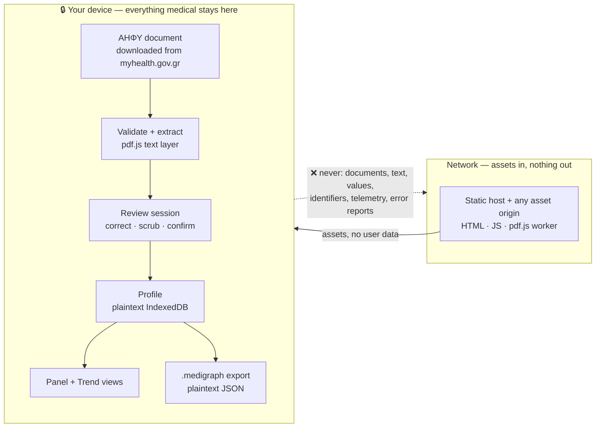

# Medigraph

**Your lab results, all of them, on one timeline — on your device.**

Every lab test you have taken in Greece is already sitting in one place: the national
digital health record, ΑΗΦΥ, which you reach at
[myhealth.gov.gr](https://www.gov.gr/ipiresies/ugeia-kai-pronoia/phakelos-ugeias/apotelesmata-diagnostikon-ergasteriakon-exetaseon)
with Taxisnet, your ΑΜΚΑ and a one-time code. What you cannot see there is all of it at
once — every ferritin result you have ever been given, side by side, each against the
reference range its own lab printed at the time.

Medigraph reads the ΑΗΦΥ documents you download, extracts a value per biological marker,
asks you to review every row, and charts each marker over time. Extraction, review,
storage and charting all happen in your browser. **No document content and no result
ever leaves your device.**

> **ΑΗΦΥ documents only.** The one accepted input is the laboratory-results PDF issued
> by the national repository. Photographs, scans and other labs' PDFs are rejected when
> you attach them.
>
> **Display only.** Medigraph shows what your labs reported and the ranges they printed.
> It does not interpret results, characterise values or trends, and is not medical
> advice.

**Status: early development.** The plan, the domain contracts and the toolchain are in
place; the extraction pipeline and the interface are being built wave by wave. See
[Roadmap](#roadmap).

---

## The hard constraint

The Medigraph operator never receives or stores medical data. That is the invariant, and
it shapes every other decision in the project.



The site is static: no server-side processing, no account, no analytics, no error
reporter, and **no user data stored on any server we operate**. Extraction is
deterministic text reading — there is no recognition step, no OCR runtime, no model
weights and no off-device inference anywhere in the product.

The rule is about data, not about the network. Medigraph fetches assets like any other
web application, and adding a font, a library or a CDN is an ordinary engineering
decision. What never happens is data going the other way.

---

## How it works

One attach batch produces one review session, which produces one atomic commit. Nothing
is charted or persisted until you confirm the whole batch.


Validation **fails closed**: a source that is not an ΑΗΦΥ document produces no rows at
all, never a partial or best-effort parse. Successful siblings in the same batch are
unaffected.

Source documents, extracted text and crops live only inside the review session. They
never enter IndexedDB, Cache Storage or an export. The patient's ΑΜΚΑ is redacted at the
identifier gate and is **never** compared to answer the same-person question — that gate
stays an explicit, unverified confirmation, because never processing a national id is
worth more than a verified answer.

### Reading the document

The document class is fixed, so validation binds the column roles, the collection date
and the identifier positions up front, and the parser never has to reconstruct a table.
What it does have to solve is **marker identity**: the same quantity arrives as
`Λευκά Αιμοσφαίρια (WBC) (WBC)` from one laboratory and bare `WBC (WBC)` from another.
Medigraph therefore anchors on the marker label — matched against the registry in tiers,
with homoglyphs folded — and reads across that row's known columns.

Two shapes need care and get it explicitly. Some laboratories emit **structural rows**
inside the table (`ΕΡΥΘΡΟΚΥΤΤΑΡΙΚΗ ΣΕΙΡΑ (LABEL RBC)`); a row whose value, unit and range
cells are all empty is a section marker, not a measurement. And a **label may wrap**
across two lines while its value sits on the second, so a row is the set of items
overlapping the value band. Interpolating glyph x-coordinates inside a text box is
forbidden — proportional fonts make fabricated geometry unsafe.

### Numeric and categorical results

A urine panel is not numbers. `Χροιά: Ωχροκίτρινη` against a printed `Κίτρινη`, and
`Λεύκωμα: Αρνητικό` against `Αρνητικό(<=10 mg/dl)`, are ordinary contents of an ΑΗΦΥ
document. Medigraph stores them as **categorical measurements**: the printed string, and
the string the lab printed as expected, verbatim.

A categorical result has no unit, is never converted, and is **never ranked** — no
ordering is defined between `Αρνητικό` and `Θετικό`, no colour encodes direction, and no
string is called better, worse or abnormal. A cell holding both a number and a word
(`Αντίδραση PH: 6.0 Όξινη`) is numeric; the word is the lab's gloss and is discarded.
See [ADR-0014](docs/adr/0014-categorical-measurements.md).

### The marker registry is the core asset

Marker anchoring is the whole parser, so **registry coverage is parser quality**
([D5a](#binding-decisions)). The layout is constant across ΑΗΦΥ documents; the marker
wording is not, and that is where accuracy is won or lost.

The registry is versioned data with its own tests and its own score, split one file per
panel, targeting ≥120 markers for v1 with Greek and English aliases. Every alias must
come from a corpus fixture or a seeded issue list — a wrong alias produces a wrong health
chart, which is worse than a missing one.

---

## Tool base

Every browser byte is self-hosted today — a cost and simplicity preference, not a rule;
a CDN is a perfectly ordinary choice. No analytics, no error reporter, no charting
library, no crypto dependency, no OCR runtime, no model weights.

| Layer        | Choice                                                                                                    |
| ------------ | --------------------------------------------------------------------------------------------------------- |
| App          | Astro 5, static output · one Preact 10 island (`MedigraphApp`)                                            |
| Charts       | Hand-written SVG Preact components — no charting library ([D11](#binding-decisions))                      |
| Vendor SDKs  | `pdfjs-dist` 5 (text layer only) and `idb` 8, importable **only** from `src/io/`                          |
| Static gates | ESLint 10 flat config → Prettier 3.9.6 (`--check`, never `--write` in CI) → `astro check && tsc --noEmit` |
| Tests        | Vitest (unit + integration) · corpus scorer · Playwright (E2E + egress regression)                        |
| Delivery     | Cloudflare Pages, static assets · committed `_headers` CSP · `sw.js` caching a declared asset list        |

**Nothing outside `io/` may import `pdfjs-dist`.** That rule is what keeps review, domain
and charts extraction-agnostic behind the
[adapter seam](docs/adr/0004-extraction-observation-seam.md): the adapter emits
positioned `TextItem`s, and everything downstream sees only those.

---

## Repository layout

```text
docs/
  plan.md              master plan — architecture, decisions, pipeline, tasks
  adr/                 accepted decision records
  agents/              issue tracker, triage labels, domain docs, commit messages
CONTEXT.md             ubiquitous language + invariants
AGENTS.md              entry point for agent contributors
```

Planned source tree (from [Architecture](docs/plan.md#architecture)):

```text
src/
  domain/   pure TypeScript, zero DOM, zero I/O — 100% unit-tested
            types · text · numbers · ranges · units · dates · registry/ · fuzzy
            markerKey · ahfyDocument · anchors · readout · rows · extract
            identifiers · review · profile · series
  io/       browser-only adapters, thin, integration-tested
            pdfText · adapter · fileRouter · fileFormat · storage
  ui/       MedigraphApp island + children
  pages/    Astro routes: index (landing), app, privacy
fixtures/
  registry-seed/  ΚΕΟΚΕΕ v5 workbook + extracted marker vocabulary (CC BY 3.0 GR)
  parser/         redacted TextItems, one directory per issuing laboratory
public/
  pdf/      self-hosted pdf.js worker
  sw.js     static-asset-only cache
```

---

## Binding decisions

The product's settled decisions, named `D1`–`D15` throughout the code, issues and ADRs.
They are not a menu: if an entry is genuinely wrong, change
[`docs/plan.md`](docs/plan.md#decisions-already-made-do-not-re-litigate) first, record it
as an ADR, and only then change code. The plan carries the full rationale for each.

| #       | Decision                                                                                                                                                                                                                                                                                            |
| ------- | --------------------------------------------------------------------------------------------------------------------------------------------------------------------------------------------------------------------------------------------------------------------------------------------------- |
| **D1**  | **No user-data egress.** Nothing derived from a document leaves the device, and no user data is stored on any server we operate — no telemetry, no error reporting, no third party. Network access is otherwise ordinary. [ADR-0015](docs/adr/0015-ordinary-network-freedom-under-the-data-rule.md) |
| **D1a** | **One input, one extraction mode:** the ΑΗΦΥ document, read through the pdf.js text layer. No OCR, no models, no off-device processing. [ADR-0013](docs/adr/0013-ahfy-documents-are-the-only-input.md)                                                                                              |
| **D2**  | **Astro 5 static + one Preact island.** Cloudflare Pages, pure static assets, no SSR.                                                                                                                                                                                                               |
| **D3**  | **Extraction is local and deterministic.** An exact character stream, no probabilistic component. [ADR-0013](docs/adr/0013-ahfy-documents-are-the-only-input.md)                                                                                                                                    |
| **D4**  | **One observation shape.** The adapter emits positioned `TextItem`s, which converge into an `ExtractionResult` before review. [ADR-0004](docs/adr/0004-extraction-observation-seam.md)                                                                                                              |
| **D5**  | **Marker-anchored parsing is the only pass.** Column roles come from the validated header, so there is no layout-discovery step.                                                                                                                                                                    |
| **D5a** | **The marker registry is the product's core asset**, versioned, corpus-tested and scored.                                                                                                                                                                                                           |
| **D6**  | **Mandatory transactional review.** One batch, one session, one atomic Confirm; one document is one Report. [ADR-0005](docs/adr/0005-transactional-review-and-identifier-gate.md)                                                                                                                   |
| **D7**  | **Identifier scrub is a hard persistence gate.** The persisted schema has no identity fields. [ADR-0005](docs/adr/0005-transactional-review-and-identifier-gate.md)                                                                                                                                 |
| **D8**  | **Plaintext IndexedDB, one anonymous local Profile.** Appending requires explicit same-person confirmation. [ADR-0006](docs/adr/0006-plaintext-local-profile-storage.md)                                                                                                                            |
| **D9**  | **Plaintext, versioned `.medigraph` JSON.** Import previews Cancel/Replace/Merge and never silently overwrites. [ADR-0007](docs/adr/0007-plaintext-medigraph-files.md)                                                                                                                              |
| **D10** | **No LOINC codes in v1.** Our own stable string ids.                                                                                                                                                                                                                                                |
| **D11** | **Charts are hand-written SVG Preact components.** No charting library.                                                                                                                                                                                                                             |
| **D12** | **No dual-axis charts, ever.** Different units are never overlaid on one y-scale.                                                                                                                                                                                                                   |
| **D13** | **Display only.** No severity language, clinical inference, trend direction or delta badge, in any view or copy. [ADR-0010](docs/adr/0010-display-only-positioning.md)                                                                                                                              |
| **D14** | **Document validation, not template recognition.** Accept or reject, then bind column roles, date and identifier positions. [ADR-0013](docs/adr/0013-ahfy-documents-are-the-only-input.md)                                                                                                          |
| **D15** | **Measurements are numeric or categorical.** A categorical result has no unit, is never converted and is never ranked. [ADR-0014](docs/adr/0014-categorical-measurements.md)                                                                                                                        |

D13 keeps Medigraph outside MDR Rule 11, and its failure mode is gradual — one "trending
low" badge, one marketing sentence promising insight. Every user-facing string, in both
languages, is reviewed against it.
[ADR-0008](docs/adr/0008-csp-style-attribute-amendment.md) scopes the CSP style
directives, and
[ADR-0016](docs/adr/0016-inline-scripts-and-the-withdrawn-isolation-headers.md)
permits Astro's inline island scripts and withdraws cross-origin isolation:
`connect-src` is the directive the plaintext `Profile` actually leans on, and it is
not relaxed.

---

## The `.medigraph` file format

A transparent, plaintext JSON envelope around one validated `Profile`:

```json
{
  "format": "medigraph",
  "v": 1,
  "profile": { "schemaVersion": 1, "id": "<uuid>", "reports": [] }
}
```

No compression, encryption, KDF or binary framing — pretty-printed with two spaces so you
can read it yourself. It contains no name, no ΑΜΚΑ, no patient id and no free text from
the source beyond marker labels you approved during review and the printed strings of
categorical results. The issuing laboratory is stored as a label on the report, which
identifies a clinic and not a person. Files over 10 MiB are rejected before parsing.

> **This file is not encrypted.** It contains your medical history; store and share it as
> carefully as the original lab reports.

Full spec: [`.medigraph` file format](docs/plan.md#the-medigraph-file-format).

---

## Roadmap

Work is decomposed into waves. Each task becomes one GitHub issue labelled
`ready-for-agent`, linking back to its section of the plan.

| Wave  | Contents                                                                                                                                                  |
| ----- | --------------------------------------------------------------------------------------------------------------------------------------------------------- |
| **0** | Domain baseline ✅ · scaffold + toolchain ✅ · contracts ✅ · ΚΕΟΚΕΕ marker seed ✅ · synthetic ΑΗΦΥ seed fixtures · CSP/headers · parser corpus · scorer |
| **1** | Pure domain functions, each a table-driven test file: text, numbers, ranges, units, dates, fuzzy, registry seed, identifiers, rows, review                |
| **2** | Anchors, read-out, document validation, reconciliation, corpus scoring, registry expansion, release baseline, profile, series                             |
| **3** | pdf.js text layer, file router, file format, storage, service worker, walking slice + `types.ts` freeze                                                   |
| **4** | `MedigraphApp` state machine, FileDrop, ReviewTable, PanelView, TrendView, DataManager, Astro routes and privacy copy                                     |
| **5** | Happy-path E2E, egress regression, bundle budget, accessibility, safety/lifecycle E2E                                                                     |

The empirical gate that decides product quality is the **parser release baseline** in
Wave 2, scored per issuing laboratory against a sealed holdout. The layout is constant,
so a score that varies between laboratories is telling you about registry and unit
coverage — which is exactly what there is to improve. No failure justifies a hidden
upload path.

---

## Verification

Every gate below is defined in [Verification](docs/plan.md#verification) and becomes
runnable as its wave lands.

| Command                | Gate                                                                                                                                                                                                                                   |
| ---------------------- | -------------------------------------------------------------------------------------------------------------------------------------------------------------------------------------------------------------------------------------- |
| `pnpm verify:static`   | ESLint → `prettier --check` → `astro check && tsc --noEmit`. CI never rewrites files.                                                                                                                                                  |
| `pnpm test`            | Vitest: pure domain tables, validator boundaries, merge transactions, file-format negative paths                                                                                                                                       |
| `pnpm corpus:score`    | Document validation on every corpus document and every negative fixture, then parser floors: aggregate marker recall ≥95%, value+comparator precision ≥99%, unit ≥95%, range ≥95%; every issuing laboratory independently ≥90% / ≥98%. |
| `pnpm playwright test` | E2E happy path, the canary egress regression and the safety/lifecycle suite, against the exact static build under production headers                                                                                                   |

The CI `lint` job gates `test` and `build`, so a formatting or lint failure stops the
pipeline before Vitest and Playwright run.

**What the privacy evidence proves, and what it does not.** The egress regression seeds
canary values into a fixture document — a marker value, an identifier, a date — and
asserts that no outgoing request carries any of them in its URL, headers or body. It
tests the rule that binds: not which origins are contacted, but whether anything derived
from your document goes out. That is exercised behaviour of the built app. It cannot
prove that malicious same-origin code with memory access is safe — pinned dependencies,
lockfile review, the strict CSP, no raw HTML and text-only rendering are part of the same
control, not claims delegated to Playwright.

---

## Corpus and fixture rules — non-negotiable

- **The corpus is ΑΗΦΥ documents supplied by their own subject.** Someone retrieves their
  own history from myhealth.gov.gr and supplies it deliberately.
- **Never harvest lab documents from the web.** Such material is other people's health
  data, and looking for it is itself the wrong act.
- **Never commit a source document.** ΑΗΦΥ documents carry ΑΜΚΑ, patient and doctor names
  and order ids. `corpus/` is gitignored; only **redacted TextItems** are committed.
  Redact expected JSON and metadata, not just visible text.
- **Diversity means issuing laboratories, not layouts.** The layout is constant; each
  laboratory is a new dialect of labels, decimal separators and unit notation. Cover the
  observed ones — Greek-name labels, bare Latin codes, comma and period decimals, units
  inside the range column, `(LABEL …)` structural rows, the qualitative urine panel.
- At least one issuing laboratory is a **blind holdout** — never an alias source before
  its first score is recorded. Synthetic ΑΗΦΥ documents cover the end-to-end tests, since
  no real one may be committed.

---

## Contributing

Read [`AGENTS.md`](AGENTS.md) first, then [`docs/plan.md`](docs/plan.md).

**`docs/plan.md` is the source of truth for this repository.** It defines the
architecture, the binding decisions, the extraction pipeline, the chart specs, the file
format, the toolchain and the task breakdown. If the plan is ambiguous, that is a bug in
the plan — stop and ask on the issue rather than choosing, and let the fix land in the
plan, not in a commit message. If implementation diverges from the plan, update the plan
in the same change.

Issues live in GitHub Issues, managed with `gh` — see
[`docs/agents/issue-tracker.md`](docs/agents/issue-tracker.md) and
[`docs/agents/triage-labels.md`](docs/agents/triage-labels.md). Commits are made by hand;
see [`docs/agents/commit-messages.md`](docs/agents/commit-messages.md).

| Document                       | What it is for                                                                                                                                                       |
| ------------------------------ | -------------------------------------------------------------------------------------------------------------------------------------------------------------------- |
| [`docs/plan.md`](docs/plan.md) | **Normative.** Architecture, decisions, field contracts, pipeline, chart specs, toolchain, task breakdown                                                            |
| [`CONTEXT.md`](CONTEXT.md)     | Compact vocabulary map and invariants; defer to the plan on conflict                                                                                                 |
| [`docs/adr/`](docs/adr/)       | Accepted decision records with context and consequences. Start with [0013](docs/adr/0013-ahfy-documents-are-the-only-input.md) — it defines what the product accepts |
| [`AGENTS.md`](AGENTS.md)       | Entry point and working rules for contributors and agents                                                                                                            |

---

## Licence

[MIT](LICENSE) © 2026 vdassios.

Medigraph is engineering work, not a medical device and not medical advice. It displays
the values and reference ranges your labs reported. Talk to a clinician about what they
mean.
