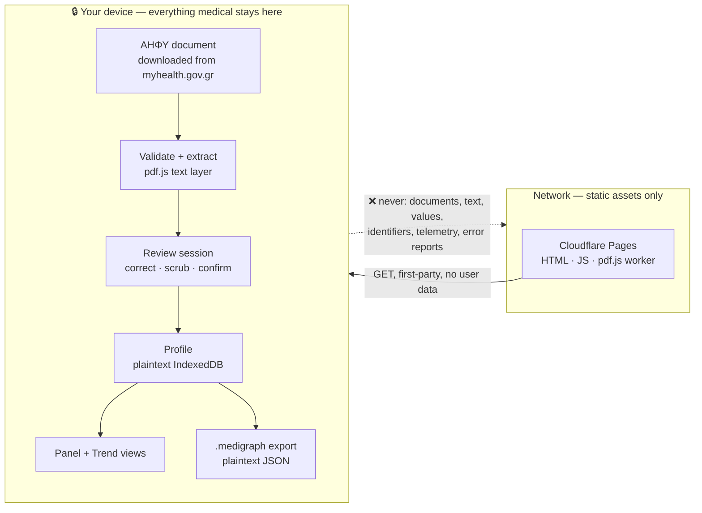
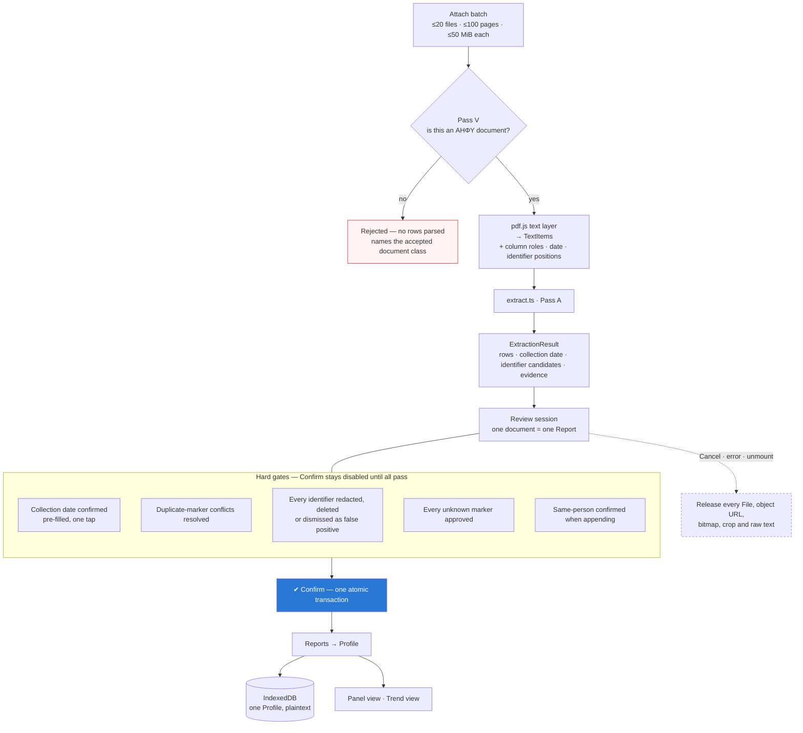
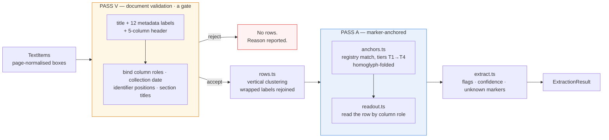
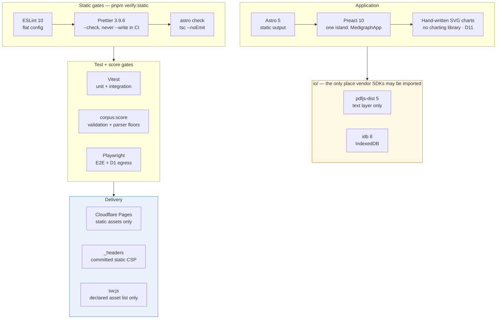
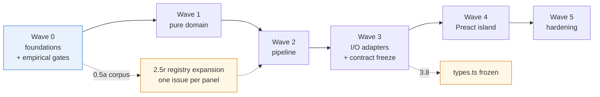

# Medigraph

**Your lab results, all of them, on one timeline — on your device.**

Every lab test you have taken in Greece is already sitting in one place: the national
digital health record, ΑΗΦΥ, which you reach at
[myhealth.gov.gr](https://www.gov.gr/ipiresies/ugeia-kai-pronoia/phakelos-ugeias/apotelesmata-diagnostikon-ergasteriakon-exetaseon)
with Taxisnet, your ΑΜΚΑ and a one-time code. What you cannot see there is all of it at
once — every ferritin result you have ever been given, side by side, each against the
reference range its own lab printed at the time.

Medigraph reads the ΑΗΦΥ documents you download, extracts a value per biological marker,
asks you to review every row, and charts each marker over time. Extraction, review,
storage and charting all happen in your browser. **No document content and no result
ever leaves your device.**

> **ΑΗΦΥ documents only.** Medigraph accepts the laboratory-results PDF issued by the
> national repository, and nothing else — not a photograph, not a scan, not the PDF a
> lab emailed you directly. See [What Medigraph accepts](#what-medigraph-accepts).

> **Display only.** Medigraph shows what your labs reported and the ranges they
> printed. It does not interpret results, characterise values or trends, and is not
> medical advice. See [D13](#binding-decisions) / [ADR-0010](docs/adr/0010-display-only-positioning.md).

---

**`docs/plan.md` is the source of truth for this repository.** It defines the
architecture, the binding decisions, the extraction pipeline, the chart specs, the
file format, the toolchain and the task breakdown. Read it before doing any work here.
If the plan is ambiguous, that is a bug in the plan — the fix belongs in the plan, not
in a commit message.

---

## The hard constraint

The Medigraph operator never receives or stores medical data. That is the invariant,
and it shapes every other decision in the project.



What this does **not** claim: it is not "no network" and not a legal conclusion. The
browser fetches first-party static assets, and the host sees ordinary asset-request
metadata. Local storage and exports are deliberately plaintext — they protect nothing
against a shared, lost or compromised device. See
[Threat model](docs/plan.md#threat-model-and-control-boundary) and
[Known risks](docs/plan.md#known-risks).

A mandatory **review-and-confirm** step sits between extraction and charting. It is not
a fallback for weak extraction — the input is an exact character stream, so there is no
recognition error to correct. It is the product's honesty mechanism: you decide what
enters your record, you clear every identifier before anything is stored, and you
confirm the date each document is filed under.

---

## What Medigraph accepts

One file class, and nothing else: the **ΑΗΦΥ document** — the laboratory-results PDF
the national repository issues. It is generated server-side, digitally signed, and
always carries a real text layer, so there is no OCR anywhere in this product.

One document is **one order**: one issuing laboratory, one collection date, every
department — haematology, biochemistry, immunology, hormones, tumour markers, urine —
consolidated into a single file. A source is therefore never split across records and
never merged with another.

The repository fixes the container. It does **not** normalise what laboratories print
inside it. Across three documents from three laboratories, all of this varied:

| Fixed by the repository                                                                               | Left to each laboratory                                              |
| ----------------------------------------------------------------------------------------------------- | -------------------------------------------------------------------- |
| Document title and the twelve metadata labels                                                         | Marker wording — `Λευκά Αιμοσφαίρια (WBC) (WBC)` or bare `WBC (WBC)` |
| The five-column table: `Περιγραφή · Αποτέλεσμα · Μονάδα Μέτρησης · Φυσιολογικές Τιμές · Παρατηρήσεις` | Decimal separator — one lab prints `5.00`, another `5,0`             |
| `Ημερομηνία Λήψης Δείγματος` as the collection date                                                   | Unit notation — `x10^3 / μL`, `k/ml` and `k/μl` for one quantity     |
| Where the identifiers sit                                                                             | Whether the range repeats its unit, and whether results are numeric  |

So the layout problem is solved and the **content** problem is not. That is why the
marker registry and the unit table carry the weight in this codebase, and why each new
issuing laboratory matters more than each new document.

Mixed-script text is normal rather than corrupt: `(ΜCV)` opens with a Greek capital mu,
the unit `Μ/μl` mixes three scripts, and one laboratory's name ends in a Latin `O`.
Normalisation folds these deliberately.

**What this costs you.** Results predating the repository, or held only on paper, cannot
be read. That is a real loss of scope, taken knowingly — see
[ADR-0013](docs/adr/0013-ahfy-documents-are-the-only-input.md).

---

## How it works

One attach batch produces one review session, which produces one atomic commit.
Nothing is charted or persisted until you confirm the whole batch.



Validation **fails closed**: a source that is not an ΑΗΦΥ document produces no rows at
all, never a partial or best-effort parse. Successful siblings in the same batch are
unaffected.

Source documents, extracted text and crops live only inside the review session. They
never enter IndexedDB, Cache Storage or an export. The patient's ΑΜΚΑ is redacted at the
identifier gate and is **never** compared to answer the same-person question — that gate
stays an explicit, unverified confirmation, because never processing a national id is
worth more than a verified answer.

### Validate, then read

The template fixes where everything sits, so the parser never reconstructs a table. What
it does have to solve is **marker identity**: the same quantity arrives as
`Λευκά Αιμοσφαίρια (WBC) (WBC)` from one laboratory and bare `WBC (WBC)` from another.
So Medigraph anchors on the marker and reads across the row's known columns.



**Pass B is gone.** Layout discovery existed to find measurement-shaped lines in tables
whose shape was unknown; with a validated five-column header there is no such table. A
`Περιγραφή` value the registry does not recognise is still read — its cells are
positionally unambiguous — and reaches review as an unknown marker for you to approve or
reassign.

Two shapes need care and get it explicitly. Some laboratories emit **structural rows**
inside the table (`ΕΡΥΘΡΟΚΥΤΤΑΡΙΚΗ ΣΕΙΡΑ (LABEL RBC)`); a row whose value, unit and range
cells are all empty is a section marker, not a measurement. And a **label may wrap**
across two lines while its value sits on the second, so a row is the set of items
overlapping the value band.

Interpolating glyph x-coordinates inside a text box is forbidden — proportional fonts
make fabricated geometry unsafe.

### Numeric and categorical results

A urine panel is not numbers. `Χροιά: Ωχροκίτρινη` against a printed `Κίτρινη`, and
`Λεύκωμα: Αρνητικό` against `Αρνητικό(<=10 mg/dl)`, are ordinary contents of an ΑΗΦΥ
document. Medigraph stores them as **categorical measurements**: the printed string, and
the string the lab printed as expected, verbatim.

A categorical result has no unit, is never converted, and is **never ranked** — no
ordering is defined between `Αρνητικό` and `Θετικό`, no colour encodes direction, and no
string is called better, worse or abnormal. A cell holding both a number and a word
(`Αντίδραση PH: 6.0 Όξινη`) is numeric; the word is the lab's gloss and is discarded.
See [ADR-0014](docs/adr/0014-categorical-measurements.md).

### The marker registry is the core asset

Pass A is the only pass, so **registry coverage is parser quality** ([D5a](#binding-decisions)),
and the pivot to one document class raised the stakes rather than lowering them: layout
no longer varies, marker wording still does.
It is versioned data with its own tests and its own score, split one file per panel,
targeting ≥120 markers for v1 with Greek and English aliases. Every alias must come
from a corpus fixture or a seeded issue list — a wrong alias produces a wrong health
chart, which is worse than a missing one.

---

## Tool base

Every browser byte is self-hosted and served first-party. No CDN, no analytics, no
error reporter, no charting library, no crypto dependency, **no OCR runtime and no
model weights**.



**Nothing outside `io/` may import `pdfjs-dist`.** That rule is what keeps review,
domain and charts extraction-agnostic behind the
[D4 adapter seam](docs/adr/0004-extraction-observation-seam.md), now narrowed to a
single observation shape.

---

## Repository layout

```text
docs/
  plan.md              master plan — architecture, decisions, pipeline, tasks
  adr/                 accepted decision records (0001–0014)
  agents/              issue tracker, triage labels, domain docs, commit messages
CONTEXT.md             ubiquitous language + invariants
AGENTS.md              entry point for agent contributors
```

Planned source tree (from [Architecture](docs/plan.md#architecture)):

```text
src/
  domain/   pure TypeScript, zero DOM, zero I/O — 100% unit-tested
            types · text · numbers · ranges · units · dates · registry/ · fuzzy
            markerKey · ahfyDocument · anchors · readout · rows · extract
            identifiers · review · profile · series
  io/       browser-only adapters, thin, integration-tested
            pdfText · adapter · fileRouter · fileFormat · storage
  ui/       MedigraphApp island + children
  pages/    Astro routes: index (landing), app, privacy
fixtures/
  registry-seed/  ΚΕΟΚΕΕ v5 workbook + extracted marker vocabulary (CC BY 3.0 GR)
  parser/         redacted TextItems, one directory per issuing laboratory
public/
  pdf/      self-hosted pdf.js worker
  sw.js     static-asset-only cache
```

---

## Binding decisions

The [decision table](docs/plan.md#decisions-already-made-do-not-re-litigate) is not a
menu. Do not re-litigate an entry: if one is genuinely wrong, change `docs/plan.md`
first, record it as an ADR, and only then change code.

| #       | Decision                                                                                                                                                                                                                                                                                                                                                                                                    | ADR                                                                                                                                  |
| ------- | ----------------------------------------------------------------------------------------------------------------------------------------------------------------------------------------------------------------------------------------------------------------------------------------------------------------------------------------------------------------------------------------------------------- | ------------------------------------------------------------------------------------------------------------------------------------ |
| **D1**  | **No user-data egress.** Nothing derived from a document leaves the device — not to Medigraph's origin, not to a third party. No telemetry, no error reporting. Inbound third-party asset fetches must be declared in the `connect-src` allowlist (empty in v1) and be GET/HEAD with no query, body or app-set header. `WebSocket`, `EventSource`, `sendBeacon`, `RTCPeerConnection` are never constructed. | [0009](docs/adr/0009-egress-data-rule-and-origin-allowlist.md) _(supersedes [0001](docs/adr/0001-no-user-data-egress.md))_           |
| **D1a** | **One extraction mode: E0.** The only accepted input is the ΑΗΦΥ document, read through the pdf.js text layer. **E1 in-browser OCR is deleted** — no engine, model, dictionary or WASM ships. E2 remains unbuilt; a remote E2 violates D1's data rule.                                                                                                                                                      | [0013](docs/adr/0013-ahfy-documents-are-the-only-input.md) _(supersedes [0003](docs/adr/0003-gated-local-ocr.md))_                   |
| **D2**  | **Astro 5 static + one Preact island.** Cloudflare Pages, pure static assets, no SSR.                                                                                                                                                                                                                                                                                                                       | —                                                                                                                                    |
| **D3**  | **All extraction is local and deterministic.** `pdfjs-dist` reads an exact character stream; there is no recognition step and no probabilistic component anywhere in the pipeline.                                                                                                                                                                                                                          | [0013](docs/adr/0013-ahfy-documents-are-the-only-input.md)                                                                           |
| **D4**  | **One observation shape, one review draft.** The adapter emits positioned `TextItem`s which converge into `ExtractionResult` before review. The direct-`ParsedRow` branch is removed with the input class closed.                                                                                                                                                                                           | [0004](docs/adr/0004-extraction-observation-seam.md), [0013](docs/adr/0013-ahfy-documents-are-the-only-input.md)                     |
| **D5**  | **Marker-anchored parsing is the only pass.** Pass B layout discovery is removed: column roles come from the validated header.                                                                                                                                                                                                                                                                              | —                                                                                                                                    |
| **D5a** | **The marker registry is the product's core asset**, versioned, corpus-tested and scored.                                                                                                                                                                                                                                                                                                                   | —                                                                                                                                    |
| **D6**  | **Mandatory transactional review.** One batch, one session, one atomic Confirm. Source grouping is removed — one document is one Report — and the collection date is confirmed rather than disambiguated.                                                                                                                                                                                                   | [0005](docs/adr/0005-transactional-review-and-identifier-gate.md), [0013](docs/adr/0013-ahfy-documents-are-the-only-input.md)        |
| **D7**  | **Identifier scrub is a hard persistence gate.** The persisted schema has no identity fields; unknown labels always appear in the scrub surface.                                                                                                                                                                                                                                                            | [0005](docs/adr/0005-transactional-review-and-identifier-gate.md)                                                                    |
| **D8**  | **Plaintext IndexedDB for one anonymous local Profile.** Appending to a non-empty Profile requires explicit same-person confirmation.                                                                                                                                                                                                                                                                       | [0006](docs/adr/0006-plaintext-local-profile-storage.md)                                                                             |
| **D9**  | **Plaintext, versioned `.medigraph` JSON.** No encryption, no passphrase. Import previews Cancel/Replace/Merge and never silently overwrites.                                                                                                                                                                                                                                                               | [0007](docs/adr/0007-plaintext-medigraph-files.md)                                                                                   |
| **D10** | **No LOINC codes in v1.** Our own stable string ids.                                                                                                                                                                                                                                                                                                                                                        | —                                                                                                                                    |
| **D11** | **Charts are hand-written SVG Preact components.** No charting library.                                                                                                                                                                                                                                                                                                                                     | —                                                                                                                                    |
| **D12** | **No dual-axis charts, ever.** Different units are never overlaid on one y-scale.                                                                                                                                                                                                                                                                                                                           | —                                                                                                                                    |
| **D13** | **Display only.** No severity language, no clinical inference, no trend direction, slope, rate of change or delta badge, in any view or in any product copy.                                                                                                                                                                                                                                                | [0010](docs/adr/0010-display-only-positioning.md)                                                                                    |
| **D14** | **Document validation, not template recognition.** `ahfyDocument.ts` accepts or rejects a source and, on acceptance, binds column roles, the collection date and the identifier positions. No fingerprint, no similarity score, no profile store.                                                                                                                                                           | [0013](docs/adr/0013-ahfy-documents-are-the-only-input.md) _(replaces [0012](docs/adr/0012-template-recognition-assists-review.md))_ |
| **D15** | **Measurements are numeric or categorical.** A categorical result is the printed string against the lab's printed expected string. It has no unit, is never converted, and is never ranked or ordered.                                                                                                                                                                                                      | [0014](docs/adr/0014-categorical-measurements.md)                                                                                    |

[ADR-0008](docs/adr/0008-csp-style-attribute-amendment.md) scopes the CSP style
directives. D13 keeps Medigraph outside MDR Rule 11, and its failure mode is gradual —
one "trending low" badge, one marketing sentence promising insight. Every user-facing
string, in both languages, is reviewed against it.

---

## The `.medigraph` file format

A transparent, plaintext JSON envelope around one validated `Profile`:

```json
{
  "format": "medigraph",
  "v": 1,
  "profile": { "schemaVersion": 1, "id": "<uuid>", "reports": [] }
}
```

No compression, encryption, KDF or binary framing — pretty-printed with two spaces so
you can read it yourself. It contains no name, no ΑΜΚΑ, no patient id and no free text
from the source beyond marker labels you approved during review and the printed strings
of categorical results. The issuing laboratory is stored as a label on the report, which
identifies a clinic and not a person. Files over 10 MiB are rejected before parsing.

> **This file is not encrypted.** It contains your medical history; store and share it
> as carefully as the original lab reports.

Full spec: [`.medigraph` file format](docs/plan.md#the-medigraph-file-format).

---

## Roadmap

Work is decomposed into waves. Each task becomes one GitHub issue labelled
`ready-for-agent`, linking back to its section of the plan.



| Wave  | Contents                                                                                                                                                       |
| ----- | -------------------------------------------------------------------------------------------------------------------------------------------------------------- |
| **0** | Domain baseline ✅ · scaffold + toolchain ✅ · contracts ✅ · synthetic ΑΗΦΥ seed fixtures · CSP/headers · ΑΗΦΥ parser corpus · ΚΕΟΚΕΕ marker seed ✅ · scorer |
| **1** | Pure domain functions, each a table-driven test file: text, numbers, ranges, units, dates, fuzzy, registry seed, identifiers, rows, review                     |
| **2** | Anchors, read-out, document validation (Pass V), reconciliation, corpus scoring, registry expansion, release baseline, profile, series                         |
| **3** | pdf.js text layer, file router, file format, storage, service worker, **E0 walking slice + `types.ts` freeze**                                                 |
| **4** | `MedigraphApp` state machine and evidence owner, FileDrop, ReviewTable, PanelView, TrendView, DataManager, Astro routes and privacy copy                       |
| **5** | Happy-path E2E, D1 egress regression, bundle budget, accessibility, safety/lifecycle E2E                                                                       |

The empirical gate that decides product quality is **Task 2.5c**: the parser release
baseline, scored per issuing laboratory against the sealed holdout. The template is
constant, so a score that varies between laboratories is telling you about registry and
unit coverage — which is exactly what there is to improve. No failure justifies a hidden
upload path.

---

## Verification

Every gate below is defined in [Verification](docs/plan.md#verification) and becomes
runnable as its wave lands.

| Command                | Gate                                                                                                                                                                                                                                   |
| ---------------------- | -------------------------------------------------------------------------------------------------------------------------------------------------------------------------------------------------------------------------------------- |
| `pnpm verify:static`   | ESLint → `eslint-config-prettier` conflict check → `prettier --check` → `astro check && tsc --noEmit`. CI never rewrites files.                                                                                                        |
| `pnpm vitest run`      | Pure domain tables, validator boundaries, merge transactions, file-format negative paths                                                                                                                                               |
| `pnpm corpus:score`    | Document validation on every corpus document and every negative fixture, then parser floors: aggregate marker recall ≥95%, value+comparator precision ≥99%, unit ≥95%, range ≥95%; every issuing laboratory independently ≥90% / ≥98%. |
| `pnpm playwright test` | E2E happy path, the D1 egress regression and the safety/lifecycle suite, against the exact static build under production headers                                                                                                       |

The CI `lint` job gates `test` and `build`, so a formatting or lint failure stops the
pipeline before Vitest and Playwright run.

**What the privacy evidence proves, and what it does not.** The egress regression test
asserts that every request targets a declared origin, that non-`self` requests carry no
query, body or app-set header, and that the banned outbound APIs are never used. That
is exercised behaviour of the built app. It cannot prove that malicious same-origin code
with memory access is safe — pinned dependencies, lockfile review, CSP, no raw HTML and
text-only rendering are part of the same control, not claims delegated to Playwright.

---

## Corpus and fixture rules — non-negotiable

- **The corpus is ΑΗΦΥ documents supplied by their own subject.** Someone retrieves
  their own history from myhealth.gov.gr and supplies it deliberately.
- **Never harvest lab documents from the web.** Such material is other people's health
  data, and looking for it is itself the wrong act.
- **Never commit a source document.** ΑΗΦΥ documents carry ΑΜΚΑ, patient and doctor
  names and order ids. `corpus/` is gitignored; only **redacted TextItems** are
  committed. Redact expected JSON and metadata, not just visible text.
- **Diversity means issuing laboratories, not layouts.** The template is constant; each
  laboratory is a new dialect of labels, decimal separators and unit notation. Cover the
  observed ones — Greek-name labels, bare Latin codes, comma and period decimals,
  units inside the range column, `(LABEL …)` structural rows, the qualitative urine
  panel.
- At least one issuing laboratory is a **blind holdout** — never an alias source before
  its first score is recorded. Task 0.3 builds synthetic ΑΗΦΥ documents for the
  end-to-end tests, since no real one may be committed.

---

## Contributing

Read [`AGENTS.md`](AGENTS.md) first, then [`docs/plan.md`](docs/plan.md).

- Conform to the decision table; do not re-litigate an entry in a commit.
- If the plan is ambiguous, stop and ask on the issue rather than choosing.
- If implementation diverges from the plan, update the plan in the same change.
- Issues live in GitHub Issues, managed with `gh` — see
  [`docs/agents/issue-tracker.md`](docs/agents/issue-tracker.md) and
  [`docs/agents/triage-labels.md`](docs/agents/triage-labels.md).
- Commits are made by hand; see
  [`docs/agents/commit-messages.md`](docs/agents/commit-messages.md).

---

## Documentation map

| Document                       | What it is for                                                                                                                                                       |
| ------------------------------ | -------------------------------------------------------------------------------------------------------------------------------------------------------------------- |
| [`docs/plan.md`](docs/plan.md) | **Normative.** Architecture, decisions, field contracts, pipeline, chart specs, toolchain, task breakdown                                                            |
| [`CONTEXT.md`](CONTEXT.md)     | Compact vocabulary map and invariants; defer to the plan on conflict                                                                                                 |
| [`docs/adr/`](docs/adr/)       | Accepted decision records with context and consequences. Start with [0013](docs/adr/0013-ahfy-documents-are-the-only-input.md) — it defines what the product accepts |
| [`AGENTS.md`](AGENTS.md)       | Entry point and working rules for contributors and agents                                                                                                            |

---

## Licence

[MIT](LICENSE) © 2026 vdassios.

Medigraph is engineering work, not a medical device and not medical advice. It
displays the values and reference ranges your labs reported. Talk to a clinician about
what they mean.
