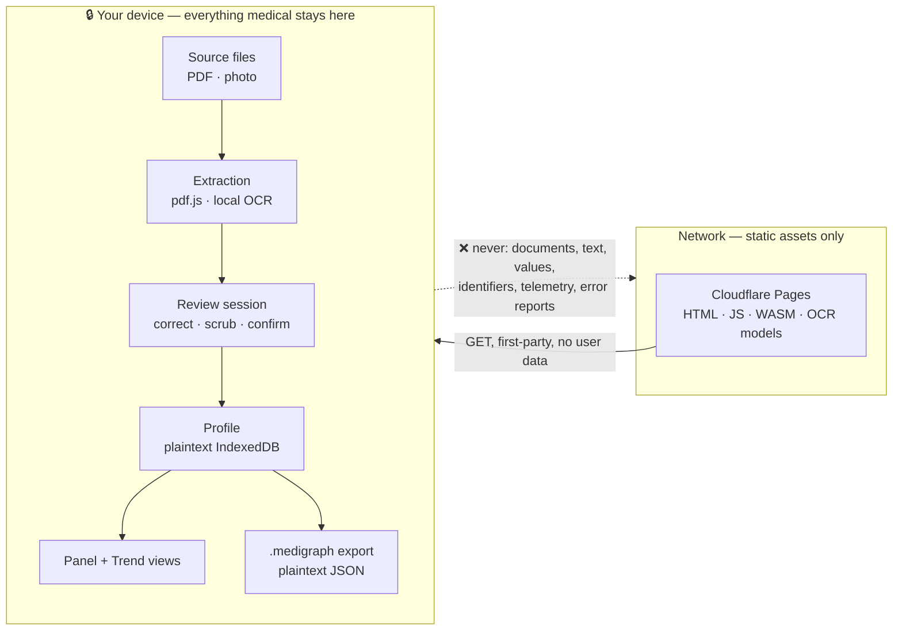
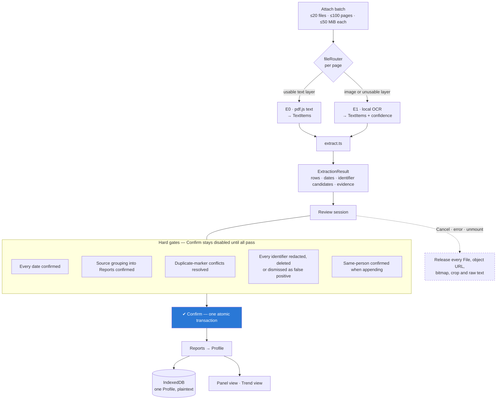
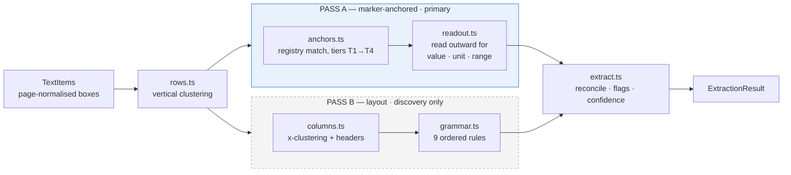
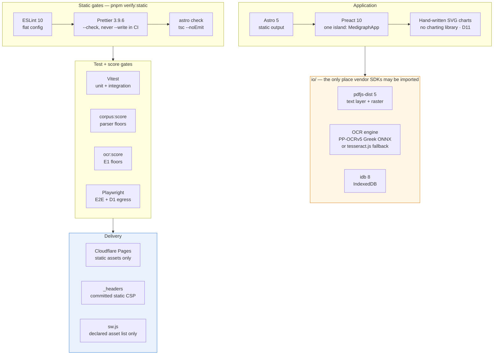
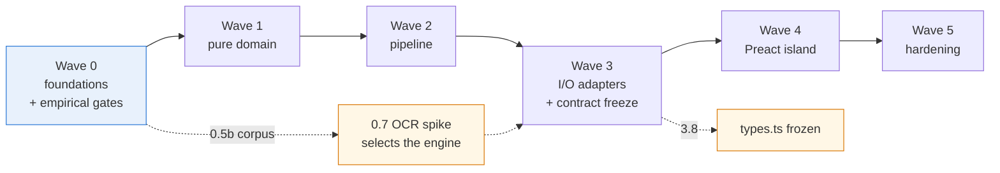

# Medigraph

**Your lab results, all of them, on one timeline — on your device.**

People accumulate lab results as loose PDFs and phone photos: one per year, from
different labs, in different languages. Any single report tells you whether a marker
is in range *today*. What nobody can see is all of it at once — every ferritin result
you have ever been given, side by side, each against the reference range its own lab
printed at the time.

Medigraph reads the files you attach, extracts a value per biological marker, asks you
to review and correct every row, and then charts each marker over time. Extraction,
review, storage and charting all happen in your browser. **No document content and no
result ever leaves your device.**

> **Display only.** Medigraph shows what your labs reported and the ranges they
> printed. It does not interpret results, characterise values or trends, and is not
> medical advice. See [D13](#binding-decisions) / [ADR-0010](docs/adr/0010-display-only-positioning.md).

---

**`docs/plan.md` is the source of truth for this repository.** It defines the
architecture, the binding decisions, the extraction pipeline, the chart specs, the
file format, the toolchain and the task breakdown. Read it before doing any work here.
If the plan is ambiguous, that is a bug in the plan — the fix belongs in the plan, not
in a commit message.

---

## The hard constraint

The Medigraph operator never receives or stores medical data. That is the invariant,
and it shapes every other decision in the project.



What this does **not** claim: it is not "no network" and not a legal conclusion. The
browser fetches first-party static assets, and the host sees ordinary asset-request
metadata. Local storage and exports are deliberately plaintext — they protect nothing
against a shared, lost or compromised device. See
[Threat model](docs/plan.md#threat-model-and-control-boundary) and
[Known risks](docs/plan.md#known-risks).

The trade is accuracy: a local rules parser is weaker than a hosted vision model, so a
mandatory **review-and-correct** step sits between extraction and charting. That step
is not a fallback — it is the product's honesty mechanism.

---

## How it works

One attach batch produces one review session, which produces one atomic commit.
Nothing is charted or persisted until you confirm the whole batch.



Source files, raw text, crops and bitmaps live only inside the review session. They
never enter IndexedDB, Cache Storage or an export.

### Two-pass extraction

Layouts differ per lab — column counts, header wording, sections, gutters, whether
units are glued to values, whether ranges even have a column. What barely differs is
the *marker*. So Medigraph anchors on the marker and reads outward, instead of
reconstructing the table and hoping the marker is in column one.



Pass B's job is **not** to parse the document. It surfaces measurement-shaped lines
Pass A did not claim, so unknown markers still reach review and registry gaps become
visible. Pass A must hit its accuracy floors with Pass B disabled — that is the proof
the parser is marker-driven rather than layout-driven.

Two geometry modes are supported and never mixed up: **fragmented** (pdf.js emits many
small boxes; spatial read-out applies) and **line** (OCR emits one box per printed
line; token-order read-out applies). Interpolating glyph x-coordinates inside a line
box is forbidden — proportional fonts make fabricated geometry unsafe.

### The marker registry is the core asset

Because Pass A is primary, **registry coverage is parser quality** ([D5a](#binding-decisions)).
It is versioned data with its own tests and its own score, split one file per panel,
targeting ≥120 markers for v1 with Greek and English aliases. Every alias must come
from a corpus fixture or a seeded issue list — a wrong alias produces a wrong health
chart, which is worse than a missing one.

---

## Tool base

Every browser byte is self-hosted and served first-party. No CDN, no analytics, no
error reporter, no charting library, no crypto dependency.



**Nothing outside `io/` may import `pdfjs-dist` or the OCR runtime.** That rule is what
keeps review, domain and charts extraction-agnostic behind the
[D4 adapter seam](docs/adr/0004-extraction-observation-seam.md).

---

## Repository layout

```text
docs/
  plan.md              master plan — architecture, decisions, pipeline, tasks
  adr/                 accepted decision records (0001–0010)
  agents/              issue tracker, triage labels, domain docs, commit messages
CONTEXT.md             ubiquitous language + invariants
AGENTS.md              entry point for agent contributors
```

Planned source tree (from [Architecture](docs/plan.md#architecture)):

```text
src/
  domain/   pure TypeScript, zero DOM, zero I/O — 100% unit-tested
            types · text · numbers · ranges · units · dates · registry/ · fuzzy
            markerKey · anchors · readout · rows · columns · grammar · extract
            identifiers · review · profile · series
  io/       browser-only adapters, thin, integration-tested
            pdfText · pdfRaster · preprocess · ocr · adapter · fileRouter
            fileFormat · storage
  ui/       MedigraphApp island + children
  pages/    Astro routes: index (landing), app, privacy
public/
  ocr/      self-hosted models, dictionary, WASM
  pdf/      self-hosted pdf.js worker
  sw.js     static-asset-only cache
```

---

## Binding decisions

The [decision table](docs/plan.md#decisions-already-made-do-not-re-litigate) is not a
menu. Do not re-litigate an entry: if one is genuinely wrong, change `docs/plan.md`
first, record it as an ADR, and only then change code.

| # | Decision | ADR |
| --- | --- | --- |
| **D1** | **No user-data egress.** Nothing derived from a document leaves the device — not to Medigraph's origin, not to a third party. No telemetry, no error reporting. Inbound third-party asset fetches must be declared in the `connect-src` allowlist (empty in v1) and be GET/HEAD with no query, body or app-set header. `WebSocket`, `EventSource`, `sendBeacon`, `RTCPeerConnection` are never constructed. | [0009](docs/adr/0009-egress-data-rule-and-origin-allowlist.md) *(supersedes [0001](docs/adr/0001-no-user-data-egress.md))* |
| **D1a** | **Extraction modes.** E0 = pdf.js text layer. E1 = the selected in-browser Greek OCR engine. E2 names a possible future document-VLM adapter; a remote E2 violates D1's data rule and needs a new ADR. No remote E2 code ships in v1. | [0002](docs/adr/0002-local-extraction-tiers.md) |
| **D2** | **Astro 5 static + one Preact island.** Cloudflare Pages, pure static assets, no SSR. | — |
| **D3** | **All v1 extraction is local and deterministic.** Task 0.7 proves PP-OCRv5 Greek ONNX or falls back to `tesseract.js`; the corpus, not vendor accuracy, decides release readiness. | [0003](docs/adr/0003-gated-local-ocr.md) |
| **D4** | **One extraction seam, two observation shapes, one review draft.** Adapters emit positioned `TextItem`s or direct `ParsedRow`s; both converge into `ExtractionResult` before review. | [0004](docs/adr/0004-extraction-observation-seam.md) |
| **D5** | **Marker-anchored parsing is primary; layout parsing is secondary.** | — |
| **D5a** | **The marker registry is the product's core asset**, versioned, corpus-tested and scored. | — |
| **D6** | **Mandatory transactional review.** One batch, one session, one atomic Confirm. | [0005](docs/adr/0005-transactional-review-and-identifier-gate.md) |
| **D7** | **Identifier scrub is a hard persistence gate.** The persisted schema has no identity fields; unknown labels always appear in the scrub surface. | [0005](docs/adr/0005-transactional-review-and-identifier-gate.md) |
| **D8** | **Plaintext IndexedDB for one anonymous local Profile.** Appending to a non-empty Profile requires explicit same-person confirmation. | [0006](docs/adr/0006-plaintext-local-profile-storage.md) |
| **D9** | **Plaintext, versioned `.medigraph` JSON.** No encryption, no passphrase. Import previews Cancel/Replace/Merge and never silently overwrites. | [0007](docs/adr/0007-plaintext-medigraph-files.md) |
| **D10** | **No LOINC codes in v1.** Our own stable string ids. | — |
| **D11** | **Charts are hand-written SVG Preact components.** No charting library. | — |
| **D12** | **No dual-axis charts, ever.** Different units are never overlaid on one y-scale. | — |
| **D13** | **Display only.** No severity language, no clinical inference, no trend direction, slope, rate of change or delta badge, in any view or in any product copy. | [0010](docs/adr/0010-display-only-positioning.md) |

[ADR-0008](docs/adr/0008-csp-style-attribute-amendment.md) scopes the CSP style
directives. D13 keeps Medigraph outside MDR Rule 11, and its failure mode is gradual —
one "trending low" badge, one marketing sentence promising insight. Every user-facing
string, in both languages, is reviewed against it.

---

## The `.medigraph` file format

A transparent, plaintext JSON envelope around one validated `Profile`:

```jsonc
{
  "format": "medigraph",
  "v": 1,
  "profile": { "schemaVersion": 1, "id": "<uuid>", "reports": [] }
}
```

No compression, encryption, KDF or binary framing — pretty-printed with two spaces so
you can read it yourself. It contains no name, no patient id, no lab id and no free
text from the source beyond marker labels you approved during review. Files over
10 MiB are rejected before parsing.

> **This file is not encrypted.** It contains your medical history; store and share it
> as carefully as the original lab reports.

Full spec: [`.medigraph` file format](docs/plan.md#the-medigraph-file-format).

---

## Roadmap

Work is decomposed into waves. Each task becomes one GitHub issue labelled
`ready-for-agent`, linking back to its section of the plan.



| Wave | Contents |
| --- | --- |
| **0** | Domain baseline ✅ · scaffold + toolchain · contracts · synthetic seed fixtures · CSP/headers · parser and OCR corpora · scorer · OCR feasibility spike |
| **1** | Pure domain functions, each a table-driven test file: text, numbers, ranges, units, dates, fuzzy, registry seed, identifiers, rows, review |
| **2** | Anchors, read-out, columns, grammar, reconciliation, corpus scoring, registry expansion, release baseline, profile, series |
| **3** | pdf.js text + raster, preprocessing, OCR engine, file router, file format, storage, service worker, **E0/E1 walking slices + `types.ts` freeze**, E1 quality gate |
| **4** | `MedigraphApp` state machine and evidence owner, FileDrop, ReviewTable, PanelView, TrendView, DataManager, Astro routes and privacy copy |
| **5** | Happy-path E2E, D1 egress regression, bundle budget, accessibility, mobile E1 release gate, safety/lifecycle E2E |

Two empirical gates decide product shape rather than being decided in advance: **Task
0.7** picks the OCR engine before Wave 3, and **Tasks 3.9 + 5.5** decide whether E1
ships as the default or clearly labelled assisted/beta. Neither failure justifies a
hidden upload path.

---

## Verification

Every gate below is defined in [Verification](docs/plan.md#verification) and becomes
runnable as its wave lands.

| Command | Gate |
| --- | --- |
| `pnpm verify:static` | ESLint → `eslint-config-prettier` conflict check → `prettier --check` → `astro check && tsc --noEmit`. CI never rewrites files. |
| `pnpm vitest run` | Pure domain tables, validator boundaries, merge transactions, file-format negative paths |
| `pnpm corpus:score` | Parser floors: aggregate marker recall ≥95%, value+comparator precision ≥99%, unit ≥95%, range ≥95%; every lab independently ≥90% / ≥98%. Pass A alone ≥90% / ≥99%. |
| `pnpm ocr:score` | E1 floors from **source pixels**, never from committed OCR TextItems: aggregate recall ≥90%, value precision ≥99%, unit/range ≥90% |
| `pnpm playwright test` | E2E happy path, the D1 egress regression and the safety/lifecycle suite, against the exact static build under production headers |

The CI `lint` job gates `test` and `build`, so a formatting or lint failure stops the
pipeline before Vitest and Playwright run.

**What the privacy evidence proves, and what it does not.** The egress regression test
asserts that every request targets a declared origin, that non-`self` requests carry no
query, body or app-set header, and that the banned outbound APIs are never used. That
is exercised behaviour of the built app. It cannot prove that malicious same-origin code
with memory access is safe — pinned dependencies, lockfile review, CSP, no raw HTML and
text-only rendering are part of the same control, not claims delegated to Playwright.

---

## Corpus and fixture rules — non-negotiable

- Prefer published specimen reports (*υπόδειγμα αποτελεσμάτων*): already synthetic,
  already public.
- **Never commit a real patient's PDF.** Real-report-derived parser fixtures commit
  redacted TextItems only. OCR source images must be public specimens or synthetic
  documents.
- Redact expected JSON and metadata, not just visible pixels — name, AMKA, patient id,
  doctor, address, phone, barcode, accession id.
- The two root `MedilabRslt29384Page*.pdf` files contain identifying text. They are
  private reference inputs, gitignored, never fixtures; Task 0.3 recreates their
  layouts synthetically.
- Parser and OCR corpora stay separate, and at least one lab in each is a **blind
  holdout** — never an alias source before its first score is recorded.

---

## Contributing

Read [`AGENTS.md`](AGENTS.md) first, then [`docs/plan.md`](docs/plan.md).

- Conform to the decision table; do not re-litigate an entry in a commit.
- If the plan is ambiguous, stop and ask on the issue rather than choosing.
- If implementation diverges from the plan, update the plan in the same change.
- Issues live in GitHub Issues, managed with `gh` — see
  [`docs/agents/issue-tracker.md`](docs/agents/issue-tracker.md) and
  [`docs/agents/triage-labels.md`](docs/agents/triage-labels.md).
- Commits are made by hand; see
  [`docs/agents/commit-messages.md`](docs/agents/commit-messages.md).

---

## Documentation map

| Document | What it is for |
| --- | --- |
| [`docs/plan.md`](docs/plan.md) | **Normative.** Architecture, decisions, field contracts, pipeline, chart specs, toolchain, task breakdown |
| [`CONTEXT.md`](CONTEXT.md) | Compact vocabulary map and invariants; defer to the plan on conflict |
| [`docs/adr/`](docs/adr/) | Accepted decision records with context and consequences |
| [`AGENTS.md`](AGENTS.md) | Entry point and working rules for contributors and agents |

---

## Licence

[MIT](LICENSE) © 2026 vdassios.

Medigraph is engineering work, not a medical device and not medical advice. It
displays the values and reference ranges your labs reported. Talk to a clinician about
what they mean.
